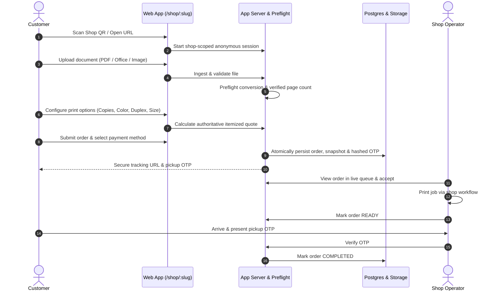

# NoWait-Print 🖨️⚡

> **Smart, Queue-Free Cloud Printing & Kiosk Management Platform for Print Shops, Campuses, and Corporate Hubs**

NoWait-Print is a multi-tenant, mobile-friendly print-ordering and shop-queue management platform. Participating print shops receive a unique public storefront and QR code. Customers scan the QR code on their phones, upload documents safely, configure print options, receive instant server-authoritative quotes, submit orders, and pick up their prints using secure OTP verification—bypassing physical queues and unsafe USB sharing.

---

## 📚 Documentation

The complete specifications, architectural designs, and operating policies are available in the [`Documentation/`](./Documentation) directory:

- 📄 **[Product & Solution Specification (V1)](./Documentation/product-and-solution-specification-v1.md)**: The authoritative baseline specification covering scope, user roles, supported file formats, conversion preflight, pricing engine, order state machine, security/RLS model, OTP verification, testing strategy, and rollout phases.

---

## 🚀 Key Highlights & Architectural Principles

1. **Server-Authoritative Pricing & State**: All calculations, permission checks, order state transitions, and quotes are evaluated server-side.
2. **Strict Multi-Tenant Isolation**: Multi-tenant separation enforced at both application service layers and database Row-Level Security (RLS).
3. **Controlled Preflight Pipeline**: Safe document ingestion, preflight validation, and sandboxed Office/image conversion into printable representations before page-based pricing.
4. **Secure Order Tracking & Handover**: Unguessable cryptographically random tracking tokens and keyed-hash pickup OTPs.
5. **Modular Monolith**: Designed for rapid development and clean domain boundaries, targeting cost-effective cloud tiers without unnecessary microservice overhead.

---

## 🔄 Core Customer Journey



---

## 📂 Repository Structure

```text
.
├── Documentation/
│   └── product-and-solution-specification-v1.md   # Core V1 Product & Solution Specification
└── README.md                                       # Project overview and navigation
```

---

## 🗺️ Roadmap Beyond V1

- **Phase A — Local Print Agent**: Desktop daemon running on the shop counter PC for automatic spooling.
- **Phase B — Hardware Printer Integration**: Native CUPS / IPP printer driver communication.
- **Phase C — Omnichannel Notifications**: SMS & WhatsApp status alerts upon order readiness.
- **Phase D — Payment Gateway**: Automated UPI gateway verification and instant reconciliation.
- **Phase E — Marketplace & Multi-Shop Discovery**: Cross-shop discovery and ordering across campus hubs.

---

## 📄 License & Ownership

Developed for **JayanthanND**. All rights reserved.
