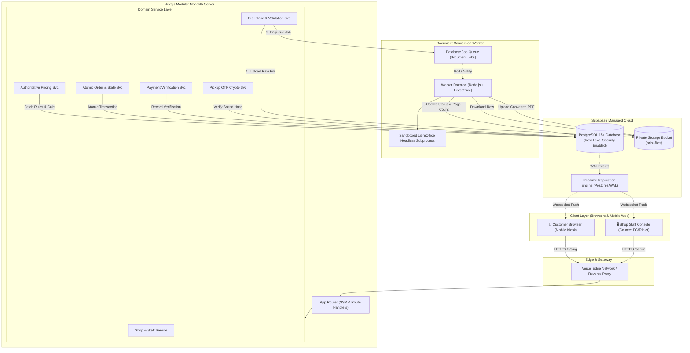
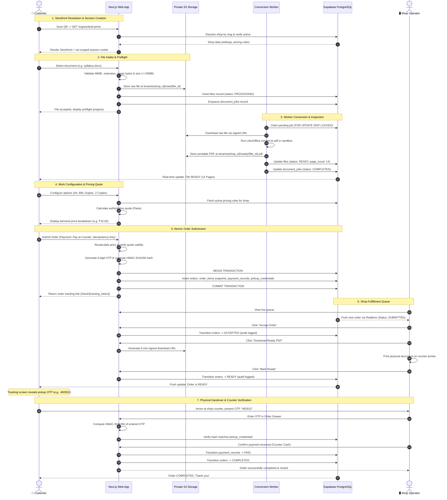

# NoWait-Print — System Architecture Document

**Document Status:** Baseline Approved / Architecture Frozen  
**Version:** 1.0 (Phase 0)  
**Date:** October 2026  
**Authors:** Senior Software Architect, Technical Lead  

---

## 1. System Overview & Architectural Style

NoWait-Print is engineered as a **Modular Monolith** deployed across managed cloud infrastructure. This pattern balances rapid development, strict domain isolation, low operational overhead, and free-tier compatibility while providing clean interfaces should individual sub-systems need horizontal extraction later.

The architecture comprises two decoupled execution environments:
1. **The Web & Application Core:** A Next.js App Router full-stack application handling customer interactions, session management, work configuration, pricing calculations, shop administration, order lifecycle, and real-time operator queues.
2. **The Document Conversion Worker:** An isolated background process running a headless LibreOffice container responsible for sandboxed format conversion (DOCX/XLSX/PPTX to PDF) and page-count verification, decoupled from web request lifecycles.

```
┌────────────────────────────────────────────────────────────────────────┐
│                        NoWait-Print Platform                           │
├───────────────────────────────────┬────────────────────────────────────┤
│         Customer Channel          │            Staff Channel           │
│  - Kiosk QR / /s/[slug]           │  - Operator Queue Dashboard        │
│  - Upload & Preflight Client      │  - Order Drawer & File Download    │
│  - Work Builder & Real-time Quote │  - Payment Verification            │
│  - Secure Tracking (/track/[tok]) │  - Counter OTP Verification        │
└─────────────────┬─────────────────┴──────────────────┬─────────────────┘
                  │                                    │
                  ▼                                    ▼
┌────────────────────────────────────────────────────────────────────────┐
│                  Next.js Web Application (Monolith)                    │
│  ┌───────────────────────┐  ┌─────────────────┐  ┌──────────────────┐  │
│  │    Customer Service   │  │ Pricing Service │  │  Order Service   │  │
│  └───────────────────────┘  └─────────────────┘  └──────────────────┘  │
│  ┌───────────────────────┐  ┌─────────────────┐  ┌──────────────────┐  │
│  │ File Intake Service   │  │ Payment Service │  │ Shop/Auth Service│  │
│  └───────────────────────┘  └─────────────────┘  └──────────────────┘  │
└──────────────────┬───────────────────────────────────┬─────────────────┘
                   │                                   │
                   ▼                                   ▼
┌──────────────────────────────────────┐   ┌─────────────────────────────┐
│    Document Worker (Isolated Job)    │   │  Supabase Managed Services  │
│  - LibreOffice Headless Daemon       │   │  - PostgreSQL 15+ with RLS  │
│  - Resource Jail (CPU/Mem limits)    │   │  - GoTrue Auth (Staff)      │
│  - Unoconv / CLI Conversion Engine   │   │  - Private S3 Object Store  │
│  - PDF Metadata Extraction           │   │  - Realtime Changefeed (WAL)│
└──────────────────────────────────────┘   └─────────────────────────────┘
```

---

## 2. Technology Stack & Decision Matrix

| Layer | Selected Technology | Version | Rationale & Justification | Alternatives Considered |
| :--- | :--- | :--- | :--- | :--- |
| **Framework** | Next.js (App Router) | 16.x / React 19 | Unified full-stack TypeScript environment; built-in server actions, route handlers, optimized streaming SSR, and edge/node runtime flexibility. | Remix, Vite + Express, Nuxt |
| **Language** | TypeScript | 5.x | End-to-end type safety across domain models, API payloads, and database schemas. | JavaScript (vanilla) |
| **UI & Styling** | Tailwind CSS + shadcn/ui | v4 / Radix | Composable accessible components, zero runtime CSS overhead, dark-mode support, and rapid mobile-first responsiveness. | Material UI, Chakra UI, Ant Design |
| **Database** | PostgreSQL via Supabase | 15+ | Enterprise relational ACID compliance, native Row-Level Security (RLS) for multi-tenancy, JSONB support for snapshotting, and transaction blocks. | MySQL, MongoDB, PlanetScale |
| **Authentication** | Supabase Auth (GoTrue) | Managed | Secure JWT-based staff authentication, session cookie encryption, and role-based access control out of the box. | NextAuth/Auth.js, Clerk, Firebase Auth |
| **Object Storage** | Supabase Storage (S3-compatible) | Managed | Private bucket architecture, integrated RLS policies, programmatic signed-URL generation with configurable expiration. | AWS S3 direct, Cloudflare R2 |
| **PDF Inspection** | `pdf-lib` | 1.17+ | Pure JavaScript in-memory PDF parsing, page counting, orientation reading, and validation without external binary dependencies. | pdfjs-dist, pdf2pic |
| **Document Worker** | LibreOffice Headless (Docker) | 7.x/24.x | Standard open-source engine capable of faithful conversion of complex DOCX, XLSX, and PPTX layouts into printable PDF formats. | Google Drive API, MS Office 365 Graph, Pandoc |
| **Icons & Motion** | Lucide Icons + Motion | Latest | Clean, lightweight icon sets and fluid micro-interactions for upload and status feedback. | Heroicons, FontAwesome |

---

## 3. High-Level System Architecture Diagram



---

## 4. End-to-End Customer Order Sequence Diagram



---

## 5. Free-Tier-First Operational & Deployment Analysis

### 5.1 Cloud Provider Constraints & Limits

| Provider / Service | Free Tier / Hobby Allocation | Operational Limits | Upgrade Trigger / Threshold |
| :--- | :--- | :--- | :--- |
| **Supabase (PostgreSQL)** | 500 MB database storage, 2 active projects. | 50,000 monthly active users, 500 MB DB limit, 1 GB file storage. Auto-pauses after 7 days of inactivity on free tier. | Upgrade to Pro ($25/mo) when database size exceeds 400 MB, file storage exceeds 1 GB, or 100+ daily orders require persistent uptime. |
| **Vercel (Next.js Web Hosting)** | Hobby tier: Unlimited deployments, 100 GB bandwidth, Serverless function execution timeout: 10s (Hobby) / 15s (Pro). | Serverless execution limit prevents running LibreOffice inside Next.js API routes. File upload payload capped at 4.5MB via standard serverless body parser. | Use direct client-to-storage signed uploads or route uploads through stream handlers. Upgrade to Pro ($20/seat) for business domain custom SSL. |
| **Worker Host (Render / Fly.io / Railway)** | Free/Hobby container execution: 512 MB RAM, shared CPU. | Free container sleep on inactivity (cold start ~30s). LibreOffice requires minimum 350 MB free RAM during complex conversions. | Run worker as an always-on micro-instance ($5–$7/mo on Fly.io / Hetzner / Railway) once pilot shops process daily volume. |

### 5.2 Handling Web Request Upload Limits
Because serverless web routes (Vercel) impose a 4.5MB request body ceiling on Hobby plans:
- **Solution:** The Next.js API initializes the upload by validating permissions and returning a pre-authenticated, short-lived S3 signed upload URL.
- The browser streams the binary payload directly into the private Supabase Storage bucket, bypassing the web server's memory and timeout constraints.
- Upon upload completion, the client notifies the server to trigger preflight inspection and enqueue conversion jobs.

---

## 6. Service Boundaries & Monolith Modularity

To preserve strict separation of concerns, the application logic is partitioned into dedicated domain services:

```
apps/web/
├── lib/
│   ├── services/
│   │   ├── shop-service.ts          # Tenant resolution, settings, hours, slugs
│   │   ├── staff-service.ts         # Staff invitations, roles, permissions
│   │   ├── file-service.ts          # MIME validation, storage keys, signed URLs
│   │   ├── pricing-service.ts       # Authoritative calculation, quote lifecycles
│   │   ├── order-service.ts         # Atomic creation, state machine transitions
│   │   ├── payment-service.ts       # Counter and manual UPI verification
│   │   ├── otp-service.ts           # Salted hashing, attempt limiting, verification
│   │   └── audit-service.ts         # Immutable state and access event logging
```

No domain service calls database tables directly without passing through tenant isolation verification.

---

## 7. Failure Modes, Backpressure & Graceful Degradation

| Scenario | System Impact | Mitigation & Recovery Strategy |
| :--- | :--- | :--- |
| **Worker Outage / Crash** | Office documents queue up; preflight remains in `PROCESSING`. | Database queue (`document_jobs`) retains jobs with exponential retry count (max 3). If worker fails after 3 tries, mark job `PROCESSING_FAILED` with customer-facing reason. Files are never priced without successful conversion. |
| **Worker Memory Spike (Decompression Bomb)** | LibreOffice crashes or hangs. | Subprocess execution wrapped in memory limits (512MB) and strict 45-second execution timeout. If exceeded, kill process tree, quarantine file, and flag as unprocessable. |
| **Supabase Realtime Disconnect** | Operator queue stops streaming live updates. | Dashboard client implements heartbeat polling fallback (every 30 seconds) whenever WebSocket connection drops, automatically resyncing state. |
| **Simultaneous Order Submissions** | Race condition or duplicate submission attempts. | Idempotency key enforced at the database level with a unique constraint on `(shop_id, idempotency_key)` valid for 60 minutes. |
| **Shop Pauses Ordering** | Customer attempts checkout during shop closure. | Atomic check during submission validates `shops.is_accepting_orders = true` inside the database transaction. If false, transaction aborts with `SHOP_PAUSED` code. |
