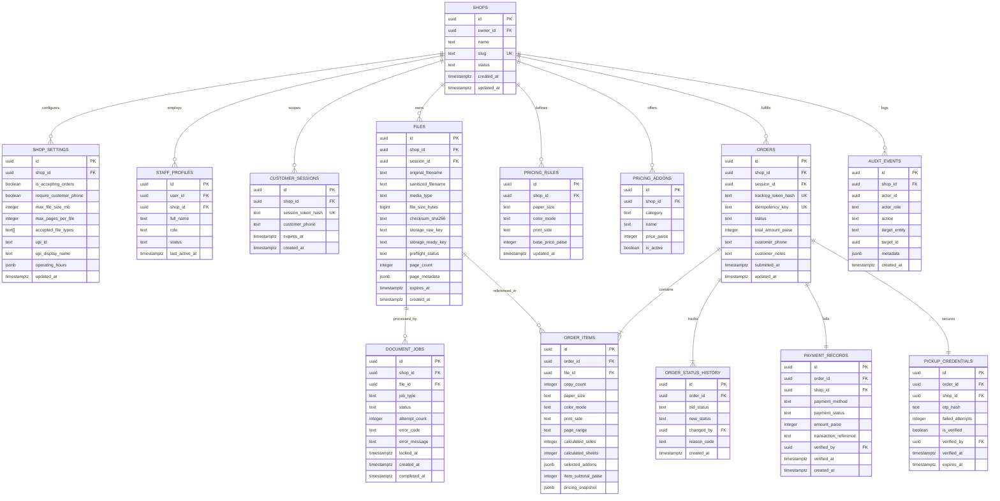

# NoWait-Print — Database Architecture & Schema Specification

**Document Status:** Baseline Approved / Schema Frozen  
**Version:** 1.0 (Phase 0)  
**Date:** October 2026  
**Authors:** Senior Database Architect, Security Engineer  

---

## 1. Design Principles & Storage Invariants

1. **Strict Multi-Tenancy:** Every operational table contains a non-nullable `shop_id UUID REFERENCES public.shops(id) ON DELETE CASCADE`.
2. **Authoritative Minor Currency Units:** All monetary amounts (rates, surcharges, totals) are stored as integer minor units (`BIGINT` or `INTEGER` representing Indian Paise; ₹1.00 = 100 paise). Floating-point numeric types are strictly forbidden for stored money.
3. **UTC Timestamps:** All temporal attributes use `TIMESTAMPTZ` recorded in UTC. Display formatting to shop local time (Asia/Kolkata) occurs in the presentation layer.
4. **Immutable Snapshots:** Orders and order items preserve an exact, frozen JSONB and column snapshot of file metadata, pricing rates, and itemized calculations at the moment of submission. Future changes to shop pricing rules never alter past order records.
5. **Capability Hashing:** Plaintext pickup OTPs and customer tracking capabilities are never stored directly in readable form; secure cryptographic hashes (HMAC-SHA256) are persisted.
6. **Row-Level Security (RLS):** All tables have RLS enabled by default with explicit policies enforcing tenant boundaries.

---

## 2. Entity-Relationship Diagram (ERD)



---

## 3. Detailed Table Specifications

### 3.1 `shops`
Core tenant entity.
```sql
CREATE TABLE public.shops (
    id UUID PRIMARY KEY DEFAULT gen_random_uuid(),
    owner_id UUID NOT NULL REFERENCES auth.users(id) ON DELETE RESTRICT,
    name TEXT NOT NULL CHECK (char_length(name) >= 3 AND char_length(name) <= 100),
    slug TEXT NOT NULL UNIQUE CHECK (slug ~ '^[a-z0-9]+(?:-[a-z0-9]+)*$'),
    status TEXT NOT NULL DEFAULT 'active' CHECK (status IN ('active', 'inactive', 'suspended')),
    created_at TIMESTAMPTZ NOT NULL DEFAULT now(),
    updated_at TIMESTAMPTZ NOT NULL DEFAULT now()
);

CREATE INDEX idx_shops_slug ON public.shops(slug);
CREATE INDEX idx_shops_owner ON public.shops(owner_id);
```

### 3.2 `shop_settings`
Tenant operational policies, payment coordinates, and upload boundaries.
```sql
CREATE TABLE public.shop_settings (
    id UUID PRIMARY KEY DEFAULT gen_random_uuid(),
    shop_id UUID NOT NULL UNIQUE REFERENCES public.shops(id) ON DELETE CASCADE,
    is_accepting_orders BOOLEAN NOT NULL DEFAULT true,
    require_customer_phone BOOLEAN NOT NULL DEFAULT false,
    max_file_size_mb INTEGER NOT NULL DEFAULT 25 CHECK (max_file_size_mb BETWEEN 5 AND 50),
    max_pages_per_file INTEGER NOT NULL DEFAULT 250 CHECK (max_pages_per_file BETWEEN 10 AND 1000),
    accepted_file_types TEXT[] NOT NULL DEFAULT ARRAY['pdf', 'docx', 'xlsx', 'pptx', 'jpg', 'jpeg', 'png', 'webp'],
    upi_id TEXT CHECK (upi_id ~ '^[\w.-]+@[\w.-]+$' OR upi_id IS NULL),
    upi_display_name TEXT,
    operating_hours JSONB NOT NULL DEFAULT '{"mon":{"open":"09:00","close":"20:00","closed":false}}'::jsonb,
    updated_at TIMESTAMPTZ NOT NULL DEFAULT now()
);
```

### 3.3 `staff_profiles`
Role-Based Access Control mapping Supabase `auth.users` to a shop tenant.
```sql
CREATE TABLE public.staff_profiles (
    id UUID PRIMARY KEY DEFAULT gen_random_uuid(),
    user_id UUID NOT NULL REFERENCES auth.users(id) ON DELETE CASCADE,
    shop_id UUID NOT NULL REFERENCES public.shops(id) ON DELETE CASCADE,
    full_name TEXT NOT NULL CHECK (char_length(full_name) >= 2),
    role TEXT NOT NULL CHECK (role IN ('owner', 'manager', 'operator')),
    status TEXT NOT NULL DEFAULT 'active' CHECK (status IN ('active', 'inactive')),
    last_active_at TIMESTAMPTZ DEFAULT now(),
    created_at TIMESTAMPTZ NOT NULL DEFAULT now(),
    updated_at TIMESTAMPTZ NOT NULL DEFAULT now(),
    CONSTRAINT uq_staff_user_shop UNIQUE (user_id, shop_id)
);

CREATE INDEX idx_staff_shop_role ON public.staff_profiles(shop_id, role);
```

### 3.4 `customer_sessions`
Temporary, anonymous customer sessions scoped to a specific shop.
```sql
CREATE TABLE public.customer_sessions (
    id UUID PRIMARY KEY DEFAULT gen_random_uuid(),
    shop_id UUID NOT NULL REFERENCES public.shops(id) ON DELETE CASCADE,
    session_token_hash TEXT NOT NULL UNIQUE,
    customer_phone TEXT CHECK (customer_phone IS NULL OR customer_phone ~ '^\+?[1-9]\d{7,14}$'),
    expires_at TIMESTAMPTZ NOT NULL,
    created_at TIMESTAMPTZ NOT NULL DEFAULT now()
);

CREATE INDEX idx_customer_sessions_token ON public.customer_sessions(session_token_hash);
CREATE INDEX idx_customer_sessions_expiry ON public.customer_sessions(expires_at);
```

### 3.5 `files`
Uploaded source files and generated print-ready PDF artifacts.
```sql
CREATE TABLE public.files (
    id UUID PRIMARY KEY DEFAULT gen_random_uuid(),
    shop_id UUID NOT NULL REFERENCES public.shops(id) ON DELETE CASCADE,
    session_id UUID REFERENCES public.customer_sessions(id) ON DELETE SET NULL,
    original_filename TEXT NOT NULL,
    sanitized_filename TEXT NOT NULL,
    media_type TEXT NOT NULL,
    file_size_bytes BIGINT NOT NULL CHECK (file_size_bytes > 0),
    checksum_sha256 TEXT NOT NULL,
    storage_raw_key TEXT NOT NULL,
    storage_ready_key TEXT,
    preflight_status TEXT NOT NULL DEFAULT 'UPLOADED' 
        CHECK (preflight_status IN ('UPLOADED', 'VALIDATING', 'PROCESSING', 'READY', 'REJECTED', 'PROCESSING_FAILED', 'EXPIRED')),
    page_count INTEGER CHECK (page_count IS NULL OR page_count > 0),
    page_metadata JSONB DEFAULT '{}'::jsonb,
    error_message TEXT,
    expires_at TIMESTAMPTZ NOT NULL,
    created_at TIMESTAMPTZ NOT NULL DEFAULT now()
);

CREATE INDEX idx_files_shop_status ON public.files(shop_id, preflight_status);
CREATE INDEX idx_files_session ON public.files(session_id);
```

### 3.6 `document_jobs`
Asynchronous preflight and conversion queue for LibreOffice worker.
```sql
CREATE TABLE public.document_jobs (
    id UUID PRIMARY KEY DEFAULT gen_random_uuid(),
    shop_id UUID NOT NULL REFERENCES public.shops(id) ON DELETE CASCADE,
    file_id UUID NOT NULL REFERENCES public.files(id) ON DELETE CASCADE,
    job_type TEXT NOT NULL CHECK (job_type IN ('CONVERSION', 'INSPECTION')),
    status TEXT NOT NULL DEFAULT 'QUEUED' 
        CHECK (status IN ('QUEUED', 'PROCESSING', 'COMPLETED', 'FAILED', 'TIMED_OUT')),
    attempt_count INTEGER NOT NULL DEFAULT 0,
    max_attempts INTEGER NOT NULL DEFAULT 3,
    error_code TEXT,
    error_message TEXT,
    locked_at TIMESTAMPTZ,
    worker_id TEXT,
    created_at TIMESTAMPTZ NOT NULL DEFAULT now(),
    completed_at TIMESTAMPTZ
);

CREATE INDEX idx_document_jobs_queue ON public.document_jobs(status, created_at) 
    WHERE status IN ('QUEUED', 'PROCESSING');
```

### 3.7 `pricing_rules` & `pricing_addons`
Shop pricing matrix stored in integer Indian paise.
```sql
CREATE TABLE public.pricing_rules (
    id UUID PRIMARY KEY DEFAULT gen_random_uuid(),
    shop_id UUID NOT NULL REFERENCES public.shops(id) ON DELETE CASCADE,
    paper_size TEXT NOT NULL CHECK (paper_size IN ('A4', 'A3', 'LETTER')),
    color_mode TEXT NOT NULL CHECK (color_mode IN ('BW', 'COLOR')),
    print_side TEXT NOT NULL CHECK (print_side IN ('SIMPLEX', 'DUPLEX')),
    base_price_paise INTEGER NOT NULL CHECK (base_price_paise > 0),
    created_at TIMESTAMPTZ NOT NULL DEFAULT now(),
    updated_at TIMESTAMPTZ NOT NULL DEFAULT now(),
    CONSTRAINT uq_pricing_matrix UNIQUE (shop_id, paper_size, color_mode, print_side)
);

CREATE TABLE public.pricing_addons (
    id UUID PRIMARY KEY DEFAULT gen_random_uuid(),
    shop_id UUID NOT NULL REFERENCES public.shops(id) ON DELETE CASCADE,
    category TEXT NOT NULL CHECK (category IN ('PAPER_TYPE', 'GSM', 'BINDING')),
    name TEXT NOT NULL,
    price_paise INTEGER NOT NULL CHECK (price_paise >= 0),
    is_active BOOLEAN NOT NULL DEFAULT true,
    CONSTRAINT uq_addon_name UNIQUE (shop_id, category, name)
);
```

### 3.8 `orders` & `order_items`
Core transactional records with immutable snapshotting.
```sql
CREATE TABLE public.orders (
    id UUID PRIMARY KEY DEFAULT gen_random_uuid(),
    shop_id UUID NOT NULL REFERENCES public.shops(id) ON DELETE RESTRICT,
    session_id UUID REFERENCES public.customer_sessions(id) ON DELETE SET NULL,
    tracking_token_hash TEXT NOT NULL UNIQUE,
    idempotency_key TEXT NOT NULL,
    status TEXT NOT NULL DEFAULT 'SUBMITTED' 
        CHECK (status IN ('SUBMITTED', 'ACCEPTED', 'PREPARING', 'READY', 'COMPLETED', 'REJECTED', 'CANCELLED', 'FAILED')),
    total_amount_paise INTEGER NOT NULL CHECK (total_amount_paise > 0),
    customer_phone TEXT,
    customer_notes TEXT,
    submitted_at TIMESTAMPTZ NOT NULL DEFAULT now(),
    updated_at TIMESTAMPTZ NOT NULL DEFAULT now(),
    CONSTRAINT uq_order_idempotency UNIQUE (shop_id, idempotency_key)
);

CREATE INDEX idx_orders_shop_queue ON public.orders(shop_id, status, submitted_at);
CREATE INDEX idx_orders_tracking ON public.orders(tracking_token_hash);

CREATE TABLE public.order_items (
    id UUID PRIMARY KEY DEFAULT gen_random_uuid(),
    order_id UUID NOT NULL REFERENCES public.orders(id) ON DELETE CASCADE,
    file_id UUID NOT NULL REFERENCES public.files(id) ON DELETE RESTRICT,
    copy_count INTEGER NOT NULL CHECK (copy_count >= 1 AND copy_count <= 500),
    paper_size TEXT NOT NULL,
    color_mode TEXT NOT NULL,
    print_side TEXT NOT NULL,
    page_range TEXT NOT NULL DEFAULT 'ALL',
    calculated_sides INTEGER NOT NULL CHECK (calculated_sides > 0),
    calculated_sheets INTEGER NOT NULL CHECK (calculated_sheets > 0),
    selected_addons JSONB NOT NULL DEFAULT '[]'::jsonb,
    item_subtotal_paise INTEGER NOT NULL CHECK (item_subtotal_paise > 0),
    pricing_snapshot JSONB NOT NULL
);

CREATE INDEX idx_order_items_order ON public.order_items(order_id);
```

### 3.9 `payment_records` & `pickup_credentials`
Payment audit and counter handover credentials.
```sql
CREATE TABLE public.payment_records (
    id UUID PRIMARY KEY DEFAULT gen_random_uuid(),
    order_id UUID NOT NULL UNIQUE REFERENCES public.orders(id) ON DELETE CASCADE,
    shop_id UUID NOT NULL REFERENCES public.shops(id) ON DELETE CASCADE,
    payment_method TEXT NOT NULL CHECK (payment_method IN ('COUNTER_CASH', 'MANUAL_UPI')),
    payment_status TEXT NOT NULL DEFAULT 'UNPAID' 
        CHECK (payment_status IN ('UNPAID', 'PENDING_MANUAL_VERIFICATION', 'PAID', 'PAYMENT_FAILED', 'REFUND_PENDING', 'REFUNDED')),
    amount_paise INTEGER NOT NULL CHECK (amount_paise > 0),
    transaction_reference TEXT,
    verified_by UUID REFERENCES public.staff_profiles(id) ON DELETE SET NULL,
    verified_at TIMESTAMPTZ,
    created_at TIMESTAMPTZ NOT NULL DEFAULT now()
);

CREATE TABLE public.pickup_credentials (
    id UUID PRIMARY KEY DEFAULT gen_random_uuid(),
    order_id UUID NOT NULL UNIQUE REFERENCES public.orders(id) ON DELETE CASCADE,
    shop_id UUID NOT NULL REFERENCES public.shops(id) ON DELETE CASCADE,
    otp_hash TEXT NOT NULL,
    failed_attempts INTEGER NOT NULL DEFAULT 0 CHECK (failed_attempts <= 5),
    is_verified BOOLEAN NOT NULL DEFAULT false,
    verified_by UUID REFERENCES public.staff_profiles(id) ON DELETE SET NULL,
    verified_at TIMESTAMPTZ,
    expires_at TIMESTAMPTZ NOT NULL,
    created_at TIMESTAMPTZ NOT NULL DEFAULT now()
);
```

### 3.10 `order_status_history` & `audit_events`
Append-only tamper-evident logs for operational accountability.
```sql
CREATE TABLE public.order_status_history (
    id UUID PRIMARY KEY DEFAULT gen_random_uuid(),
    order_id UUID NOT NULL REFERENCES public.orders(id) ON DELETE CASCADE,
    old_status TEXT,
    new_status TEXT NOT NULL,
    changed_by UUID REFERENCES auth.users(id) ON DELETE SET NULL,
    reason_code TEXT,
    metadata JSONB DEFAULT '{}'::jsonb,
    created_at TIMESTAMPTZ NOT NULL DEFAULT now()
);

CREATE TABLE public.audit_events (
    id UUID PRIMARY KEY DEFAULT gen_random_uuid(),
    shop_id UUID NOT NULL REFERENCES public.shops(id) ON DELETE CASCADE,
    actor_id UUID REFERENCES auth.users(id) ON DELETE SET NULL,
    actor_role TEXT NOT NULL,
    action TEXT NOT NULL,
    target_entity TEXT NOT NULL,
    target_id UUID,
    metadata JSONB DEFAULT '{}'::jsonb,
    ip_hash TEXT,
    created_at TIMESTAMPTZ NOT NULL DEFAULT now()
);

CREATE INDEX idx_audit_shop ON public.audit_events(shop_id, created_at);
```

---

## 4. Migration & Schema Versioning Guidelines

1. **Version Controlled Scripts:** Migrations are tracked sequentially in `supabase/migrations/` using timestamp prefixes (e.g. `20261003140000_init_schema.sql`).
2. **Deterministic & Idempotent:** Every script must use transaction wrappers (`BEGIN ... COMMIT`) and idempotent DDL (`CREATE TABLE IF NOT EXISTS`, `DROP POLICY IF EXISTS`).
3. **Zero Plaintext Credentials:** No secrets, test passwords, or production keys may ever be committed into migration files.
4. **CI Migration Gate:** In future phases, Supabase CLI runs `supabase db test` in GitHub Actions prior to applying migrations to staging/production databases.
