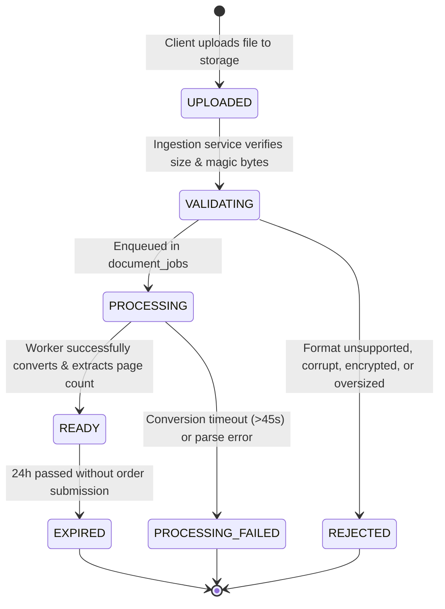
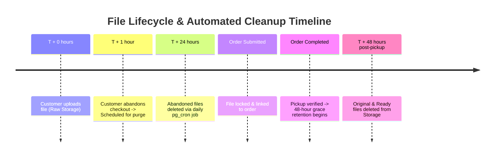

# NoWait-Print — Document Processing & Preflight Pipeline Specification

**Document Status:** Baseline Approved / Pipeline Frozen  
**Version:** 1.0 (Phase 0)  
**Date:** October 2026  
**Authors:** Senior Infrastructure Architect, Security Engineer  

---

## 1. Supported File Formats Matrix

| Category | Extensions | MIME Types | Preflight Validation Strategy | Conversion Required? | Normalization / Output |
| :--- | :--- | :--- | :--- | :---: | :--- |
| **PDF** | `.pdf` | `application/pdf` | Magic byte check (`%PDF-`), parse cross-reference table, reject encrypted/password-protected files. | No | In-place metadata extraction via `pdf-lib` (page count, dimensions). |
| **Word** | `.doc`, `.docx` | `application/msword`, `application/vnd.openxmlformats-officedocument.wordprocessingml.document` | Magic bytes check, ZIP structure validation, strip embedded macros (`vbaProject.bin`). | **Yes** | LibreOffice Headless container converts to PDF/A. |
| **Excel** | `.xls`, `.xlsx` | `application/vnd.ms-excel`, `application/vnd.openxmlformats-officedocument.spreadsheetml.sheet` | Magic bytes check, workbook sheet parsing, evaluate print area and sheet count. | **Yes** | Converted to multi-page PDF formatted to A4 with fit-to-page margins. |
| **PowerPoint** | `.ppt`, `.pptx` | `application/vnd.ms-powerpoint`, `application/vnd.openxmlformats-officedocument.presentationml.presentation` | Magic bytes check, slide count validation, strip active content. | **Yes** | Converted to PDF where 1 slide = 1 printable page image. |
| **Images** | `.jpg`, `.jpeg`, `.png`, `.webp` | `image/jpeg`, `image/png`, `image/webp` | Header signature check, EXIF orientation sanitization, dimension validation. | **Yes** | Normalized into single-page PDF centered on target paper size (A4). |

---

## 2. Preflight State Machine



---

## 3. Worker Architecture & Execution Boundary

```
┌────────────────────────────────────────────────────────────────────────┐
│                        Document Worker Daemon                          │
│                                                                        │
│   ┌────────────────────────────────────────────────────────────────┐   │
│   │                      Job Poller / Listener                     │   │
│   │  SELECT * FROM document_jobs WHERE status='QUEUED'             │   │
│   │  FOR UPDATE SKIP LOCKED LIMIT 1;                               │   │
│   └───────────────────────────────┬────────────────────────────────┘   │
│                                   │                                    │
│                                   ▼                                    │
│   ┌────────────────────────────────────────────────────────────────┐   │
│   │               Sandboxed Subprocess Execution Jail              │   │
│   │  - Non-root user (uid: 10001, gid: 10001)                      │   │
│   │  - Read-only root filesystem; writable /tmp with 256MB tmpfs   │   │
│   │  - Network disabled (--net=none)                               │   │
│   │  - Memory limit: 512MB (--memory=512m)                         │   │
│   │  - CPU quota: 1.0 core (--cpus=1.0)                            │   │
│   │  - Execution Timeout: 45 seconds (SIGKILL after 45s)           │   │
│   │                                                                │   │
│   │  Command:                                                      │   │
│   │  libreoffice --headless --convert-to pdf:writer_pdf_Export     │   │
│   │              --outdir /tmp/output /tmp/input/document.docx     │   │
│   └───────────────────────────────┬────────────────────────────────┘   │
│                                   │                                    │
│                                   ▼                                    │
│   ┌────────────────────────────────────────────────────────────────┐   │
│   │                   Post-Processing & Artifact                   │   │
│   │  1. Parse output PDF with pdf-lib to get exact page count      │   │
│   │  2. Stream ready PDF to Supabase Storage                       │   │
│   │     (tenants/{shop_id}/ready/{file_id}.pdf)                    │   │
│   │  3. Update files table (preflight_status='READY', page_count)  │   │
│   │  4. Update document_jobs table (status='COMPLETED')            │   │
│   └────────────────────────────────────────────────────────────────┘   │
└────────────────────────────────────────────────────────────────────────┘
```

---

## 4. Format-Specific Preflight Logic

### 4.1 Native PDF Handling
- Evaluated directly within the web runtime or worker using `pdf-lib`.
- In-memory inspection verifies header (`%PDF-`), counts pages via `pdfDoc.getPageCount()`, and reads page dimension boxes (MediaBox/CropBox).
- **Encrypted Files:** Checked via `pdfDoc.isEncrypted`. If true, preflight immediately transitions to `REJECTED` with error code `FILE_PASSWORD_PROTECTED`.

### 4.2 Excel Spreadsheets (`.xls`, `.xlsx`)
- Spreadsheets present pagination ambiguity. Unformatted sheets can generate hundreds of blank or single-column pages.
- **Conversion Strategy:**
  1. LibreOffice converts workbook to PDF using `calc_pdf_Export`.
  2. The converter fits columns to single-page width (`FitToPagesWide = 1`).
  3. Preflight inspects total page count. If page count exceeds `shop_settings.max_pages_per_file` (default 250), file is rejected with `EXCESSIVE_PAGE_COUNT`.

### 4.3 Image Normalization (`.jpg`, `.png`, `.webp`)
- Images are wrapped into an authoritative single-page PDF document.
- Image aspect ratio is preserved. It is scaled with a 15mm printable margin and centered on the standard A4 paper canvas.
- Page count for a standalone image is strictly $1$.

---

## 5. Storage Security & File Retention Lifecycle



1. **Abandoned Uploads:** Unsubmitted files linked to customer sessions older than 24 hours are automatically purged by a database cron (`pg_cron`) worker.
2. **Completed Order Files:** Once an order reaches `COMPLETED`, customer documents remain accessible for 48 hours to resolve reprints or disputes, after which the storage objects are permanently deleted.
3. **Audit Immutability:** Deleting physical storage objects does not delete order metadata; the order snapshot and financial audit log remain indefinitely.
