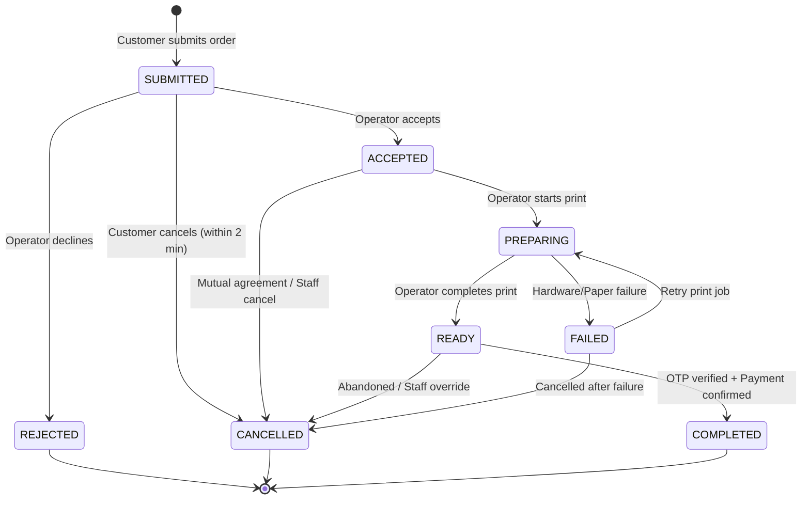
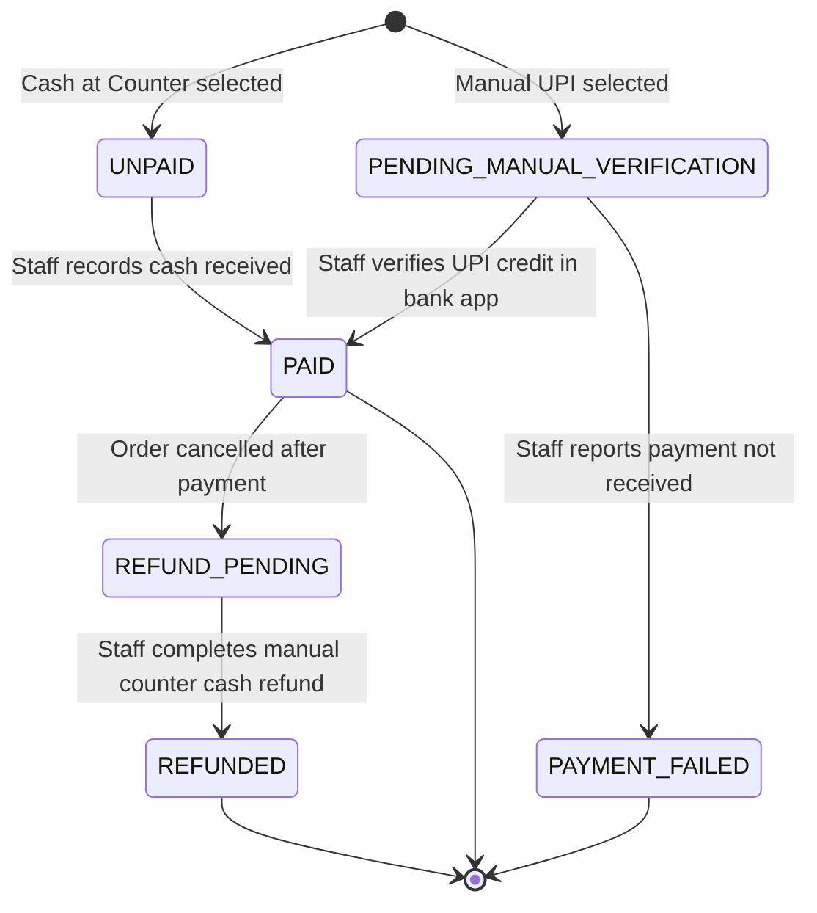

# NoWait-Print — Order Lifecycle, State Machine & Payment Flows

**Document Status:** Baseline Approved / Workflow Frozen  
**Version:** 1.0 (Phase 0)  
**Date:** October 2026  
**Authors:** Senior Solutions Architect, Technical Lead  

---

## 1. Order State Machine Specification

The order lifecycle is governed by an authoritative server-enforced finite state machine. Client applications cannot supply arbitrary status strings; every transition must satisfy predefined actor roles, guard conditions, and database transaction boundaries.



---

## 2. Permitted State Transitions & Guard Policies

| Current State | Target State | Permitted Actors | Guard Conditions & Pre-requisites | Side Effects & Actions |
| :--- | :--- | :--- | :--- | :--- |
| **NONE** | `SUBMITTED` | Customer | Idempotency key verified; all files in `READY` preflight state; quote recalculation matches submitted total. | Atomically insert order, order items snapshot, payment record, and hashed OTP; emit realtime event. |
| `SUBMITTED` | `ACCEPTED` | Operator, Manager, Owner | Shop is currently active; order is within queue capacity. | Log `order_status_history`; notify customer tracking page via Realtime. |
| `SUBMITTED` | `REJECTED` | Operator, Manager, Owner | Valid rejection reason code supplied (e.g., `OUT_OF_PAPER`, `CORRUPT_CONTENT`, `STORE_CLOSING`). | Log rejection code; release reserved queue slot; update tracking screen. |
| `SUBMITTED` | `CANCELLED` | Customer | Order submitted < 120 seconds ago; operator has not yet transitioned to `ACCEPTED`. | Transition payment to `REFUND_PENDING` if UPI; update tracking screen. |
| `ACCEPTED` | `PREPARING` | Operator, Manager, Owner | Operator has downloaded print file and initiated physical printer workflow. | Realtime status update to customer tracking view. |
| `PREPARING` | `READY` | Operator, Manager, Owner | Physical sheets printed and sorted at shop counter. | **Plaintext pickup OTP released** to customer tracking view; mark timestamp. |
| `READY` | `COMPLETED` | Operator, Manager, Owner | Customer-presented OTP verified against hash; payment record verified as `PAID`. | Record `verified_by`, `verified_at`; close order; schedule file retention countdown. |
| Any Active | `CANCELLED` | Manager, Owner | Explicit operational justification recorded in audit log. | If already paid, mark payment `REFUND_PENDING` for manual counter settlement. |
| `PREPARING` | `FAILED` | Operator, Manager, Owner | Physical printer jam, toner exhaustion, or machine failure. | Record error reason; alert staff dashboard for reprint or cancellation. |

---

## 3. Atomic Order Creation Workflow

To eliminate partial order records and duplicate submissions:
1. **Idempotency Check:** The client generates a UUIDv4 idempotency key per order intent.
2. **Transaction Scope:** Order creation executes inside a PostgreSQL serializable transaction:
   ```sql
   BEGIN;
   -- 1. Verify idempotency
   -- 2. Verify shop.is_accepting_orders = true
   -- 3. Lock files row and verify preflight_status = 'READY'
   -- 4. Calculate authoritative price
   -- 5. Insert orders
   -- 6. Insert order_items (with frozen pricing & file snapshot)
   -- 7. Insert payment_records
   -- 8. Insert pickup_credentials (HMAC-SHA256 hashed OTP)
   -- 9. Insert initial order_status_history
   COMMIT;
   ```
3. If an identical idempotency key is submitted within 60 minutes, the server skips re-insertion and returns the previously generated tracking capability.

---

## 4. Payment State Machine & Manual Verification



### 4.1 Payment Policies
- **Manual UPI Protocol:** Displaying a UPI QR code or showing a transaction reference ID from a banking app is treated as an unverified claim. The payment status remains `PENDING_MANUAL_VERIFICATION` until the operator cross-references the credit in their own merchant UPI application and explicitly clicks "Verify Payment" in the dashboard drawer.
- **Handover Invariant:** An order cannot transition to `COMPLETED` unless its payment record is `PAID`.

---

## 5. Pickup OTP Lifecycle & Cryptographic Rules

1. **Generation:** At order creation, a 6-digit numeric string ($100000 - 999999$) is generated using Node.js `crypto.randomInt`.
2. **Storage:** Stored in `pickup_credentials` as `HMAC-SHA256(order_id + ":" + otp, OTP_SECRET)`.
3. **Release Rule:** The tracking API route evaluates:
   ```typescript
   if (order.status === 'READY') {
       return { pickupOtp: order.decryptedOtp };
   } else {
       return { pickupOtp: null, message: "OTP will be revealed when printing is complete." };
   }
   ```
4. **Counter Verification Algorithm:**
   - Operator inputs the 6-digit code presented by the customer into the dashboard.
   - The server computes the HMAC-SHA256 hash of the entered code using the secret and `order_id`.
   - Compares the computed hash using constant-time string comparison (`crypto.timingSafeEqual`).
   - If match: marks `is_verified = true`, transitions order to `COMPLETED`.
   - If mismatch: increments `failed_attempts`. If `failed_attempts >= 5`, the credential is locked to prevent brute-force attacks.
5. **Regeneration:** If a customer misplaces their code or the attempt limit is reached, a shop manager can regenerate a new OTP with an audited reason.

---

## 6. Cancellation & Refund Rules

| Order State at Cancellation | Allowed Actor | Customer Self-Cancel | Payment Impact | Physical File Status |
| :--- | :--- | :---: | :--- | :--- |
| `SUBMITTED` | Customer or Staff | Yes (within 2 min) | If UPI marked, flag `REFUND_PENDING`. | Deleted from active queue. |
| `ACCEPTED` | Staff only | No | Full manual refund required if paid. | Job discarded. |
| `PREPARING` | Staff only | No | Physical paper consumed; refund subject to shop policy. | Printed sheets recycled/shredded. |
| `READY` | Staff only | No | Product completed; customer forfeit unless shop grants exception. | Held at counter for 48 hours. |
| `COMPLETED` | Non-cancellable | No | Finalized. | Scheduled for automated deletion. |
