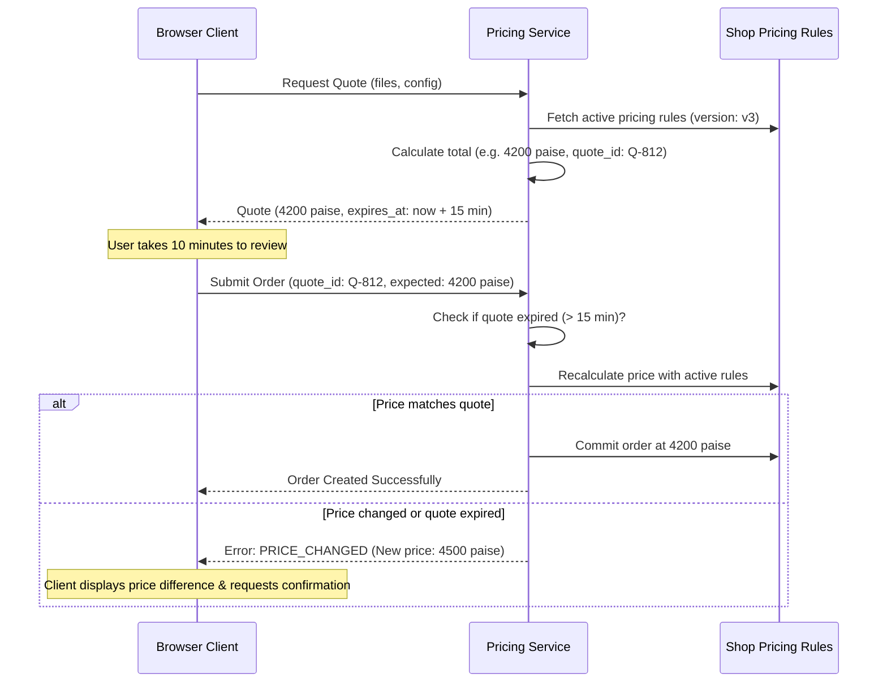

# NoWait-Print — Pricing Engine & Calculation Specification

**Document Status:** Baseline Approved / Pricing Frozen  
**Version:** 1.0 (Phase 0)  
**Date:** October 2026  
**Authors:** Senior Financial Systems Architect, Technical Lead  

---

## 1. Principles & Currency Representation

1. **Server Authoritative:** The client calculates local estimates solely for user interface feedback. All binding quotes and final order totals are calculated and validated by the backend service.
2. **Integer Minor Units:** All monetary values are represented and stored as **integer Indian Paise** (`1 INR = 100 paise`). Storing currency as floating-point numbers (`FLOAT`, `DOUBLE`) is prohibited.
3. **Per-Printed-Side Rate Model:** Base printing fees are calculated per printed side (page image on paper). Duplex printing may have a discounted per-side rate configured by the shop.
4. **Immutable Snapshots:** At order submission, the complete pricing formula, rates, and component totals are frozen in the order's JSONB snapshot.

---

## 2. Core Concepts: Pages, Sides, Sheets & Copies

- **Document Pages ($P$):** The verified number of logical pages in the printable PDF (determined by preflight or custom page range).
- **Copies ($C$):** The number of times the work item is reproduced (integer $\ge 1$).
- **Printed Sides ($S$):** The total page surfaces inked:
  $$S = P \times C$$
- **Physical Sheets ($H$):** The total physical pieces of paper consumed:
  - For **Simplex (Single-sided):**
    $$H_{\text{simplex}} = S = P \times C$$
  - For **Duplex (Double-sided):**
    $$H_{\text{duplex}} = \lceil P / 2 \rceil \times C$$

---

## 3. Pricing Matrix & Dimensions

### 3.1 Base Print Rates (`pricing_rules`)
Configured per shop for each combination of `(paper_size, color_mode, print_side)`:

| Paper Size | Color Mode | Print Side | Typical Rate (INR) | Stored `base_price_paise` |
| :--- | :--- | :--- | :--- | :--- |
| **A4** | Black & White | Simplex | ₹2.00 / side | `200` |
| **A4** | Black & White | Duplex | ₹1.50 / side | `150` |
| **A4** | Color | Simplex | ₹10.00 / side | `1000` |
| **A4** | Color | Duplex | ₹8.00 / side | `800` |
| **A3** | Black & White | Simplex | ₹5.00 / side | `500` |
| **A3** | Color | Simplex | ₹20.00 / side | `2000` |

### 3.2 Addon Surcharges (`pricing_addons`)
- **GSM Weight Surcharge:** Charged per physical sheet ($H$).
  - 75 GSM: `0` paise
  - 80 GSM: `50` paise per sheet (₹0.50)
  - 100 GSM: `150` paise per sheet (₹1.50)
- **Paper Type Surcharge:** Charged per physical sheet ($H$).
  - Regular Bond: `0` paise
  - Glossy Photo Paper: `500` paise per sheet (₹5.00)
- **Finishing & Binding:** Charged per work item copy ($C$).
  - None: `0` paise
  - Staple Corner: `200` paise per copy (₹2.00)
  - Spiral Binding: `5000` paise per copy (₹50.00)
  - Hardcover Binding: `15000` paise per copy (₹150.00)

---

## 4. Arithmetic Calculation Formulas

For each work item $i$:

$$\text{BasePrintCost}_i = S_i \times \text{BaseRatePaise}$$

$$\text{SheetSurcharge}_i = H_i \times (\text{GsmRatePaise} + \text{PaperTypeRatePaise})$$

$$\text{FinishingCost}_i = C_i \times \text{BindingRatePaise}$$

$$\text{WorkItemSubtotal}_i = \text{BasePrintCost}_i + \text{SheetSurcharge}_i + \text{FinishingCost}_i$$

$$\text{OrderTotalPaise} = \sum_{i=1}^{N} \text{WorkItemSubtotal}_i$$

---

## 5. Quote Lifecycle & Reconfirmation Protocol

---

## 6. Concrete Calculation Example

### Scenario:
A student uploads a 15-page project report (`thesis.pdf`) and requests:
- **Paper Size:** A4
- **Color Mode:** Black & White
- **Print Side:** Duplex
- **Paper Quality:** 80 GSM
- **Finishing:** Spiral Binding
- **Quantity:** 2 Copies

### Step-by-Step Evaluation:
1. **Document Pages ($P$):** 15
2. **Copies ($C$):** 2
3. **Printed Sides ($S$):** $15 \times 2 = 30$ sides
4. **Physical Sheets ($H$):** $\lceil 15 / 2 \rceil \times 2 = 8 \times 2 = 16$ sheets
5. **Base Print Rate:** A4 BW Duplex = 150 paise/side
   $$\text{BasePrintCost} = 30 \times 150 = 4,500 \text{ paise}$$
6. **Sheet Surcharge:** 80 GSM = 50 paise/sheet
   $$\text{SheetSurcharge} = 16 \times 50 = 800 \text{ paise}$$
7. **Finishing Cost:** Spiral Binding = 5,000 paise/copy
   $$\text{FinishingCost} = 2 \times 5,000 = 10,000 \text{ paise}$$
8. **Work Item Subtotal:**
   $$4,500 + 800 + 10,000 = 15,300 \text{ paise (₹153.00)}$$
9. **Order Total:**
   $$\mathbf{15,300 \text{ paise (₹153.00)}}$$
